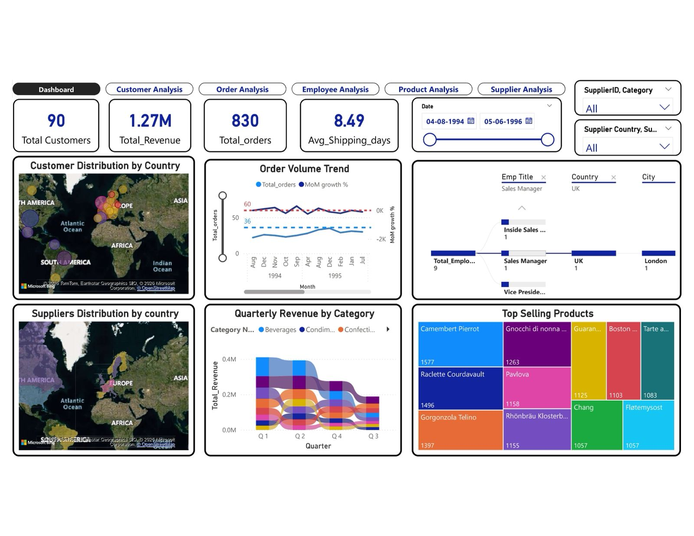
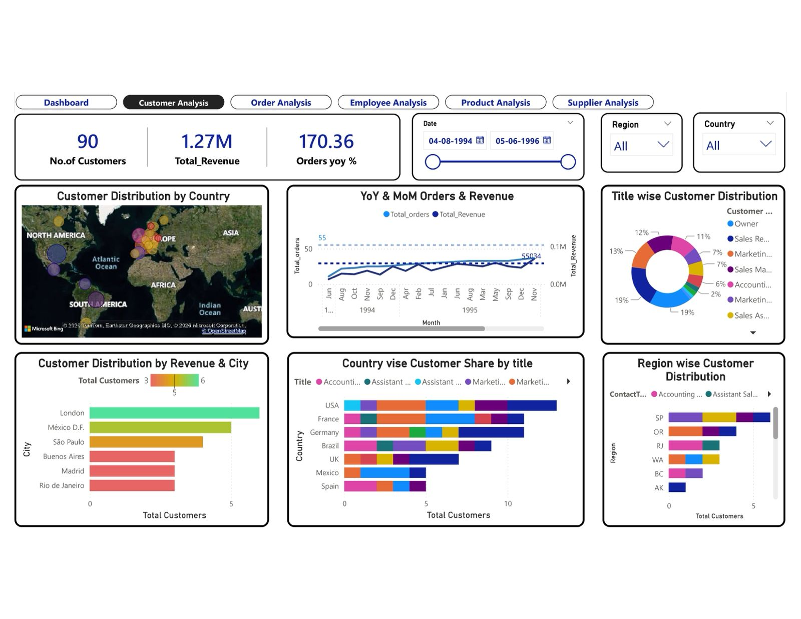
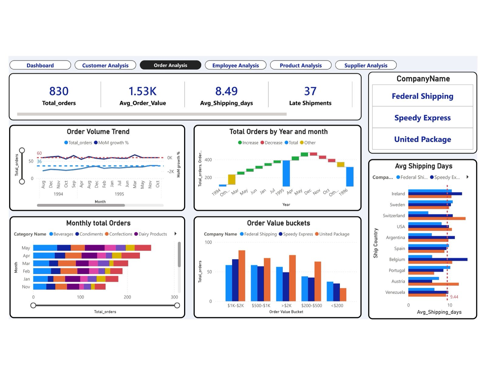
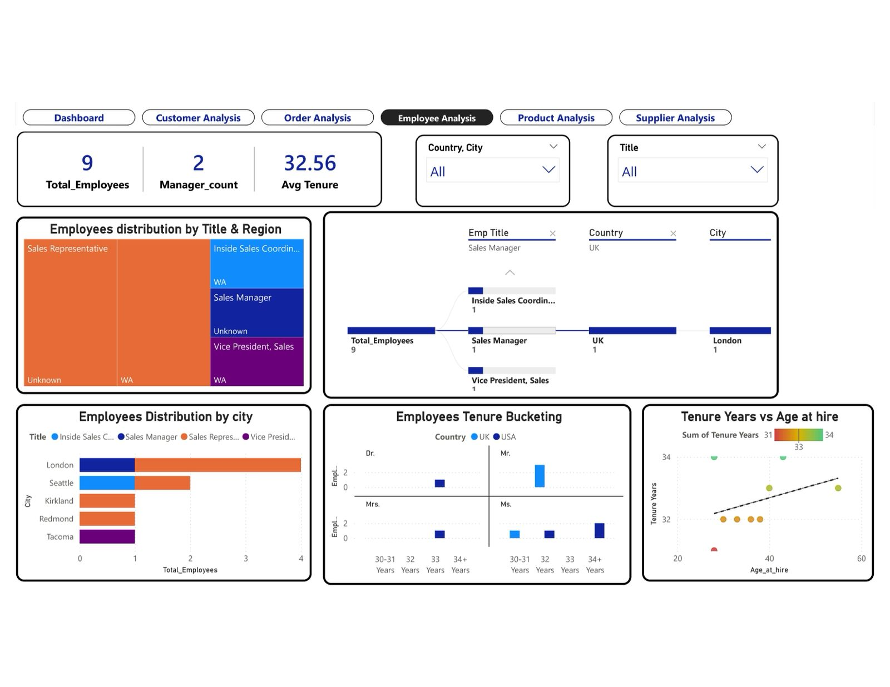
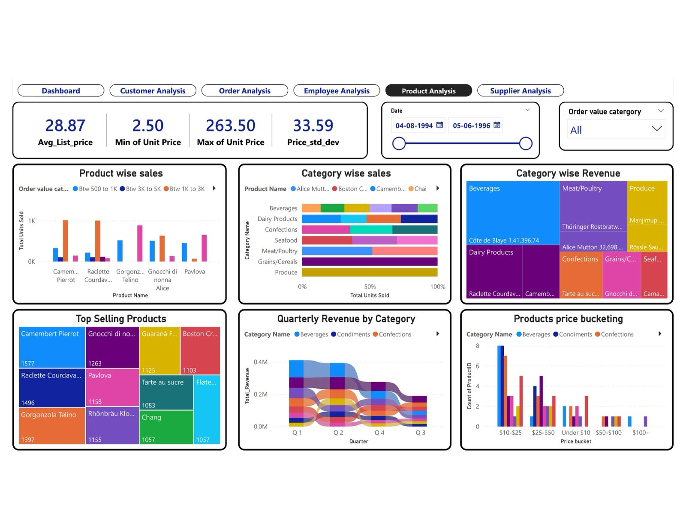
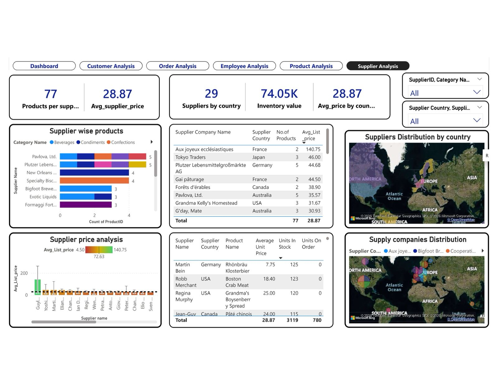

# Northwind Traders — Data Analytics Dashboard
> Power BI | Excel | SQL | End-to-End Analytics Project
---
## Problem Statement
The objective of this project is to build a comprehensive Power BI
dashboard for Northwind Traders — a fictitious wholesale food company
that imports and exports specialty foods worldwide.
The report delivers insights across four key areas:
- Sales Analysis — revenue trends, top products, category performance
- Customer Segmentation — purchase behaviour and geographic spread
- Employee Performance — order handling and productivity metrics
- Inventory & Logistics — stock levels, supplier & shipper analysis
The expected outcome is to empower stakeholders with interactive,
data-driven visualizations that support faster and better decisions.
---
## Dataset Description

**Source:** Northwind Database (Microsoft sample database)  
**Domain:** Wholesale specialty food import/export  
**Tables:** 8 relational tables  

| Table | Key Fields |
|---|---|
| Customers | CustomerID, CompanyName, Country, City |
| Employees | EmployeeID, Name, Title, HireDate, ReportsTo |
| Orders | OrderID, CustomerID, EmployeeID, OrderDate, Freight |
| Order Details | OrderID, ProductID, UnitPrice, Quantity, Discount |
| Products | ProductID, ProductName, CategoryID, UnitPrice |
| Suppliers | SupplierID, CompanyName, Country |
| Shippers | ShipperID, CompanyName, Phone |
| Categories | CategoryID, CategoryName, Description |
---
## Project Structure

| Folder | Contents |
|---|---|
| 01_Problem_Statement/ | Problem statement document |
| 02_Data_Description/ | Table-by-table dataset notes |
| 03_MECE_Breakdown/ | MECE framework breakdown PDF |
| 04_EDA_Analysis/ | Exploratory Data Analysis workbook |
| 05_Power_BI_Reports/ | `.pbix` files — 15 business questions + complete dashboard |
| 06_Presentation/ | Final PowerPoint presentation |
| 07_Dashboard_Screenshots/ | Dashboard sheet previews and KPI visuals |
---
## Dashboard Preview

### Main Dashboard

### Customer Analysis

### Order Analysis

### Employee Analysis

### Product Analysis

### Supplier Analysis

---
## Tools Used

| Tool | Purpose |
|---|---|
| Power BI | Dashboard creation, KPI tracking, and interactive visualizations |
| Excel | Exploratory Data Analysis (EDA), data cleaning, and pivot analysis |
| SQL | Data extraction, transformation, and business querying |
| PowerPoint | Final project presentation and business storytelling |

---
